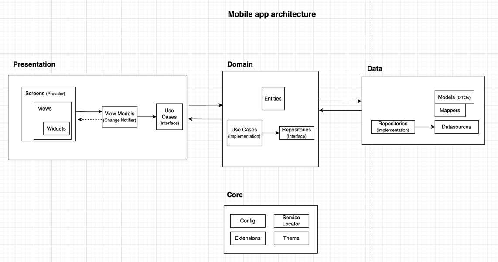
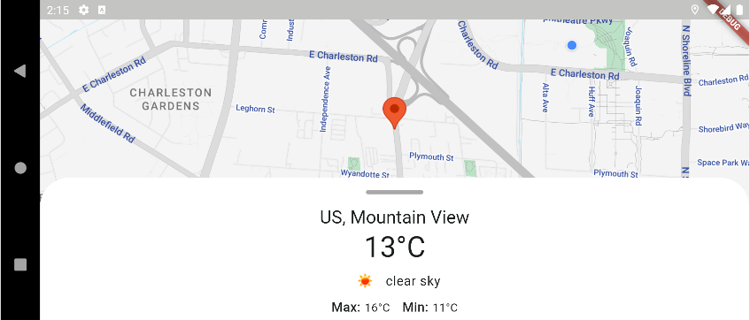
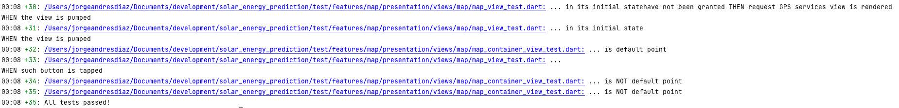

# Overview: Solar Energy Prediction (Flutter app)

Welcome to Solar Energy Prediction, the Stori Mobile Take-Home test for Flutter mobile developers.

# What's included

1. A Flutter app with modular architecture, Domain Driven Design, MVVM, SOLID principles, and Provider state management.



2. Besides, libraries and frameworks such as:
- **animate_do**: for widget animation purposes.
- **dartz**: for Either wrapper.
- **dio**: for network requests.
- **flutter_dotenv**: for reading .env config files.
- **get_it**: for service locator feature.
- **go_router**: for navigation purposes.
- **golden_toolkit**: for golden testing.
- **google_maps_flutter**: for maps navigation.
- **intl**: for texts internationalization.
- **json_annotation**: for json mappers creation.
- **location**: for gps and location services.
- **mockito**: to create mocks and define stubs in tests.
- **provider**: for state management.

3. This project contains unit tests, widget tests, and golden tests.


### Project structure

(L1)
- **lib**: root of the Flutter app. All project's code resides here.
- **android**: this folder contains native setup for the Android app, such as location permissions definition and maps key setup.
- **ios**: this folder contains native setup for the iOS app, such as location permissions definition and maps key setup.

(L2)
- **core**: a folder to place all shared logic that cannot be represented by the Clean Architecture layers. For instance, routing framework, string resources, mixins classes of utilities, service locator...
- **features**: a folder containing all app features. In this case, the map feature is included here.

(L3)
- **map**: this folder represents the _map feature_. This is divided by 3 layers which are presented below.

(L4)
- **presentation**: this layer contains UI, widgets, and defined interactions that serve as entry point for the users.
- **domain**: here, you can find the core of the app. All business rules related to the problem to be solved are included. Entities and UseCases will indicate what this weather app is about.
- **infrastructure**: this layer defines the access to external services such as OpenWeatherAPI or other datasources.


### Demo:


### Small device:


### Landscape mode:



# Installation

1. Clone this repository and import in into **Android Studio**:

```bash  
git clone https://github.com/JorgeDiazz/SolarEnergyPrediction.git
```  

2. To download required dependencies
```
flutter pub get
```

3. Rename .env.template to .env and set the following key:
```
OPEN_WEATHER_MAP_KEY=5e07f82e7fb83ad9d7d94971f2b7630a
```

4. To generate files:
```
dart run build_runner build --delete-conflicting-outputs
```

5. To run the app:
```
flutter run -d [device_id]
```

6. Besides, you will want to run tests and validate linters:

- To run all tests and generate Golden tests images
```
flutter test --update-goldens
```




- To format the project source code:
```
1. dart analyze .
2. dart format .
```

--

**Flutter version: 3.16.2**

--